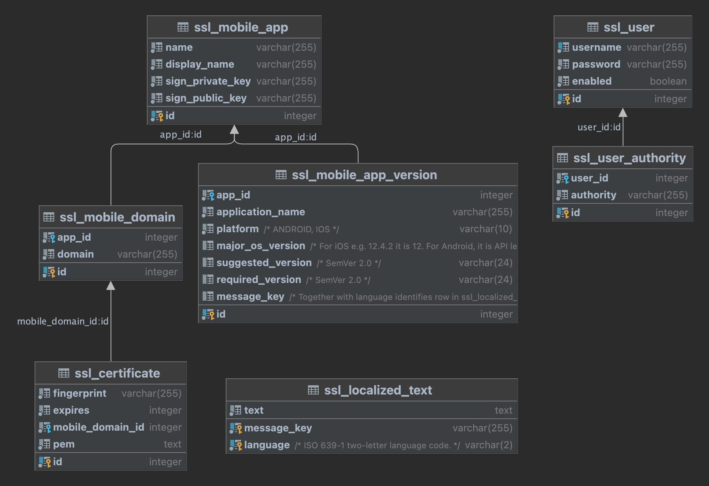

# Database Structure

<!-- TEMPLATE database -->

The database structure is extremely simple, we provide an example in PostgreSQL to describe it.

## Schema Overview

The following image captures the overview of the tables in the schema:



## Database Tables

<!-- begin database table ssl_mobile_app -->
### Mobile Applications

Contains information related to various mobile apps.

#### Schema

```sql
CREATE TABLE mobile_app (
    id INTEGER PRIMARY KEY,
    name VARCHAR(255) NOT NULL,
    display_name VARCHAR(255) NOT NULL,
    sign_private_key VARCHAR(255) NOT NULL,
    sign_public_key VARCHAR(255) NOT NULL
);
```

#### Columns

| Column             | Type           | Description                                                                                                                                      |
|--------------------|----------------|--------------------------------------------------------------------------------------------------------------------------------------------------|
| `id`               | `INTEGER`      | Primary key for the table, automatically incremented value.                                                                                      |
| `name`             | `VARCHAR(255)` | Name of the application, a machine readable value, such as `wlt-demo-app`.                                                                       |
| `display_name`     | `VARCHAR(255)` | Display name of the application, a human readable value, such as `Wultra Demo App`.                                                              |
| `sign_private_key` | `VARCHAR(255)` | Base64-encoded private key associated with the application. It is used for signing the data on the server side.                                  |
| `sign_public_key`  | `VARCHAR(255)` | Base64-encoded public key associated with the application. It is used by the client applications when verifying data signed on the server side.  |
<-- end -->

<!-- begin database table ssl_mobile_domain -->
### Mobile App Domains

Contains information related to pinned domains.

#### Schema

```sql
CREATE TABLE ssl_mobile_domain (
    id INTEGER PRIMARY KEY,
    app_id INTEGER NOT NULL,
    domain VARCHAR(255) NOT NULL
);
```

#### Columns

| Column             | Type           | Description                                                 |
|--------------------|----------------|-------------------------------------------------------------|
| `id`               | `INTEGER`      | Primary key for the table, automatically incremented value. |
| `app_id`           | `INTEGER`      | Reference to related mobile app entity.                     |
| `domain`           | `VARCHAR(255)` | Host name of the domain, such as `mobile.wultra.com`.       |
<!-- end -->

<!-- begin database table ssl_mobile_fingerprint -->
### SSL Certificate Fingerprints 

Table with TLS/SSL certificate fingerprints that should be pinned in the mobile app.

#### Schema

```sql
CREATE TABLE ssl_mobile_fingerprint (
    id INTEGER PRIMARY KEY,
    fingerprint VARCHAR(255) NOT NULL,
    expires INTEGER NOT NULL,
    mobile_domain_id INTEGER NOT NULL
);
```

#### Columns

| Column              | Type           | Description                                                               |
|---------------------|----------------|---------------------------------------------------------------------------|
| `id`                | `INTEGER`      | Primary key for the table, automatically incremented value.               |
| `fingerprint`       | `VARCHAR(255)` | Value of the certificate fingerprint.                                     |
| `expires`           | `INTEGER`      | Unix timestamp (seconds since Jan 1, 1970) of the certificate expiration. |
| `mobile_domain_id`  | `INTEGER`      | Reference to related application domain in the `ssl_mobile_domain` table. |
<!-- end -->

<!-- begin database table ssl_user -->
### Administration User

Table with users for basic HTTP authentication

#### Schema

```sql
CREATE TABLE ssl_user (
    id INTEGER PRIMARY KEY,
    username VARCHAR(255) NOT NULL UNIQUE,
    password VARCHAR(255) NOT NULL,
    enabled BOOLEAN NOT NULL
);
```

#### Columns

| Column             | Type           | Description                                                                 |
|--------------------|----------------|-----------------------------------------------------------------------------|
| `id`               | `INTEGER`      | Primary key for the table, automatically incremented value.                 |
| `username`         | `VARCHAR(255)` | Username of the user.                                                       |
| `password`         | `VARCHAR(255)` | Password of the user (bcrypt by default, or `{SHA-256} prefix for SHA-256). |
| `enabled`          | `BOOLEAN`      | Indication if the user is enabled or not                                    |
<!-- end -->

<!-- begin database table ssl_user_authority -->
### Administrative User Authorities

Table with users authorities.

#### Schema

```sql
CREATE TABLE ssl_user_authority (
    id INTEGER PRIMARY KEY,
    user_id INTEGER NOT NULL UNIQUE,
    authority VARCHAR(255) NOT NULL
);
```

#### Columns

| Column      | Type           | Description                                                          |
|-------------|----------------|----------------------------------------------------------------------|
| `id`        | `INTEGER`      | Primary key for the table, automatically incremented value.          |
| `user_id`   | `INTEGER`      | Foreign key column referencing users in `ssl_user` table.            |
| `authority` | `VARCHAR(255)` | Name of authority for the user prefixed with `ROLE_` (`ROLE_ADMIN`). |
<!-- end -->

## Sequences

<!-- begin database sequence ssl_mobile_app_seq -->
### Mobile App Sequence

Sequence responsible for mobile app autoincrements.

#### Schema

```sql
CREATE SEQUENCE IF NOT EXISTS ssl_mobile_app_seq MAXVALUE 9999999999999 CACHE 20;
```
<!-- end -->

<!-- begin database sequence ssl_mobile_domain_seq -->
### Mobile App Domain Sequence

Sequence responsible for mobile domain autoincrements.

#### Schema

```sql
CREATE SEQUENCE IF NOT EXISTS ssl_mobile_domain_seq MAXVALUE 9999999999999 CACHE 20;
```
<!-- end -->

<!-- begin database sequence ssl_mobile_fingerprint_seq -->
### SSL Certificate Fingerprint Sequence

Sequence responsible for SSL fingerprints autoincrements.

#### Schema

```sql
CREATE SEQUENCE IF NOT EXISTS ssl_mobile_fingerprint_seq MAXVALUE 9999999999999 CACHE 20;
```
<!-- end -->

## Foreign Indexes

The tables are relatively small and as a result, do not require indexes. To marginally improve the lookup performance, you can create the following foreign indexes.

<!-- begin database index ssl_mobile_fingerprint -->
### Foreign Index for SSL Fingerprint Lookup

#### Schema
```sql
ALTER TABLE ssl_mobile_fingerprint
    ADD CONSTRAINT mobile_ssl_pinning_app_fk FOREIGN KEY (mobile_domain_id)
        REFERENCES ssl_mobile_domain ON UPDATE CASCADE ON DELETE CASCADE;
```
<!-- end -->

<!-- begin database index ssl_mobile_domain -->
### Foreign Index for Domain Lookup

#### Schema
```sql
ALTER TABLE ssl_mobile_domain
    ADD CONSTRAINT ssl_mobile_domain_fk FOREIGN KEY (app_id)
        REFERENCES ssl_mobile_app ON UPDATE CASCADE ON DELETE CASCADE;
```
<!-- end -->

<!-- begin database index ssl_user_authority -->
### Foreign Index for User Authority Lookup

#### Schema
```sql
ALTER TABLE ssl_user_authority
    ADD CONSTRAINT ssl_user_fk FOREIGN KEY (app_id)
        REFERENCES ssl_user ON UPDATE CASCADE ON DELETE CASCADE;
```
<!-- end -->
